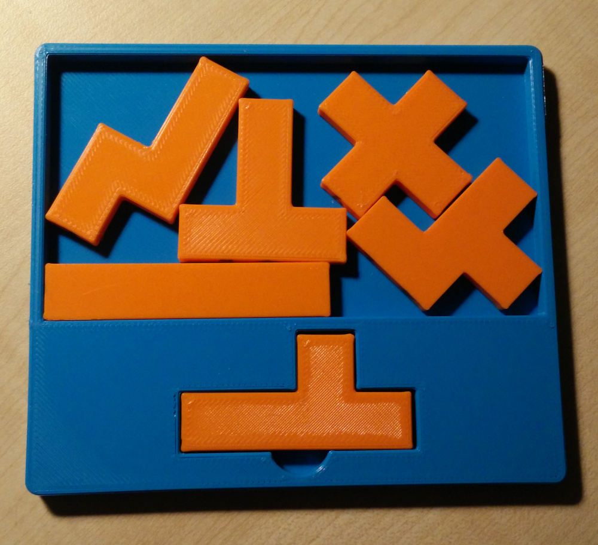

# packominoes

This project searches for 2d pentomino packing puzzles along the lines of Four Fit by Stewart Coffin:

***SPOILERS: If you want to solve Six Fit, download it from prusaprinters.org and don't read the rest of this README until after you've solved it.***

The key to this puzzle is that there is a way to fit the pieces inside the box, but there is *not* a
way to do so in which the edges of the pieces are aligned with the edges of the box.

This project was used to design (discover?) the "Six Fit" puzzle:

The programs in this repository are not very efficient. In particular, instead of exhaustively searching over
the set of all pentomino sets, `findpentos` should solve the grid with the assumption that it has all pentominoes
and then output all of the solutions it finds. It works for now, but as we move to higher piece counts performance
will become more important.

I expect it would be possible to find a Seven Fit and possibly Eight Fit, although the chances get slimmer as the numbers get higher because the number of possible ways to fit the pieces together start making it impossible to find a box that permits a "diagonal" solution without also permitting an "orthogonal" solution. Hope that makes sense. 

Here's the process used to find a new puzzle:

## 1. Find a skewed playing field

Edit the variables in `boxes` and run it to find a possible outer grid and skewed packing field.
There is an art to this as the setting of `$stepsize` is very sensitive.

It's not simply the case that a
smaller step size finds more solutions, because some values will "jump over" possible solutions that larger
values might land on by luck. The general principle is that we brute force over a lot of possible offsets
and angles for the skewed grid, and throw away all possibilities that don't fit within a sufficiently
small axis-aligned bounding box, or don't have the correct number of cells.
You just need to experiment with it to find solutions. A better `boxes` program would be helpful.

For Six Fit, the playing field is this:

    ##########
    #      ###
    #        #
    #        #
    ##       #
    ######## #
    ##########

Its bounding box is about 8.71 by 4.77, so we need to make sure there is *not* a solution using the
same set of pieces that can fit in an 8x4 rectangle:

    ##########
    #        #
    #        #
    #        #
    #        #
    ##########

Here's a sketch showing how the bounding box fits the playing field:

## 2. Find pentominoes

Write the ASCII art descriptions of the 2 playing fields into 2 files, and run
`findpentos N GOODAREA BADAREA` to brute-force for a set of pentominoes that can tile the skewed field but not the outer grid.

You're looking for outputs where the skewed playing field has a solution but the square one does not. These sets of
pentominoes will be called out as "GOOD" in the output, and a full list will be output at the end.

## Contact

This project is by James Stanley. You can email me at james@incoherency.co.uk or read my blog at https://incoherency.co.uk/
